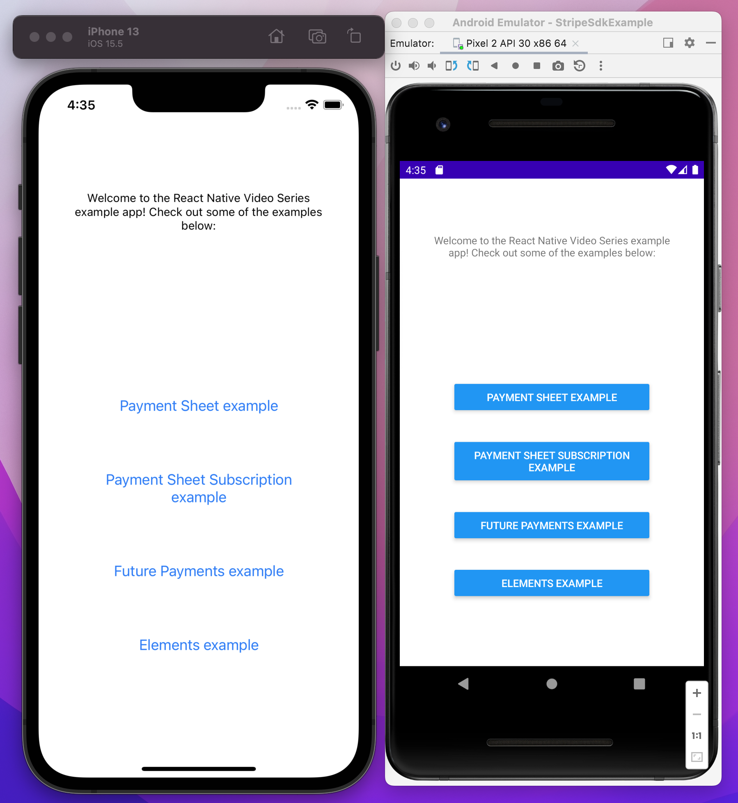

# React Native Video Series Examples

Welcome! This project contains the examples covered in Stripe's React Native video series. Spinning these up is pretty easy, as long as you've run a React Native project before.

The steps to run the app are:

1. Clone the repository
2. run `yarn` in the root of the repository.
3. run `cd ios && pod install && cd ..`
4. Set your [Stripe API keys](https://stripe.com/docs/development/quickstart#api-keys) in the `.env` file (this is your publishable key and your secret key)
5. In one terminal window, start the server by running `yarn server`.
6. In another terminal window, build the app by running either `yarn ios` or `yarn android`.

